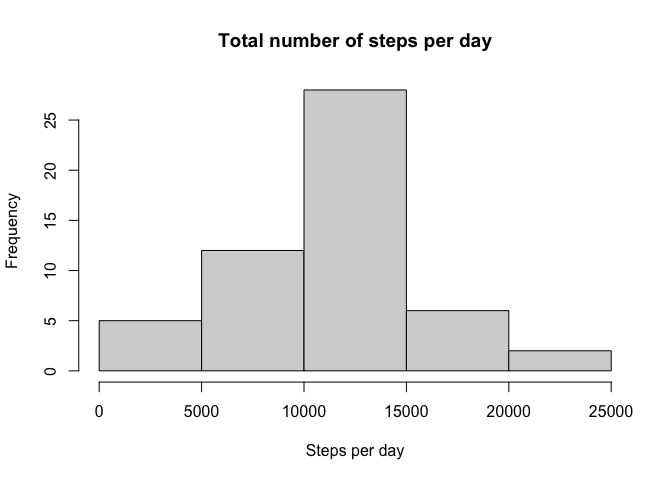
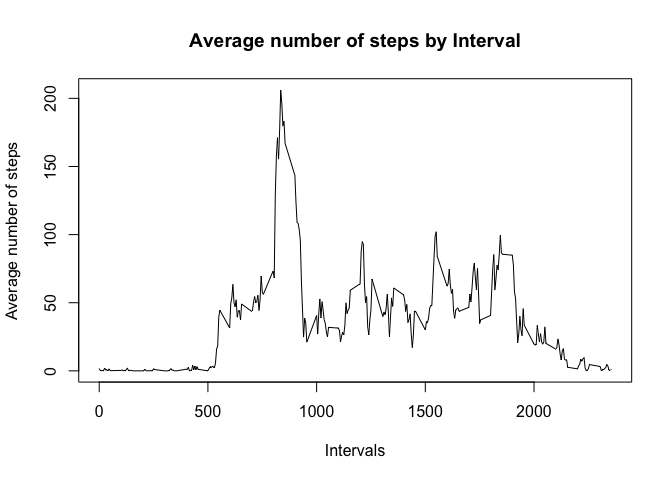
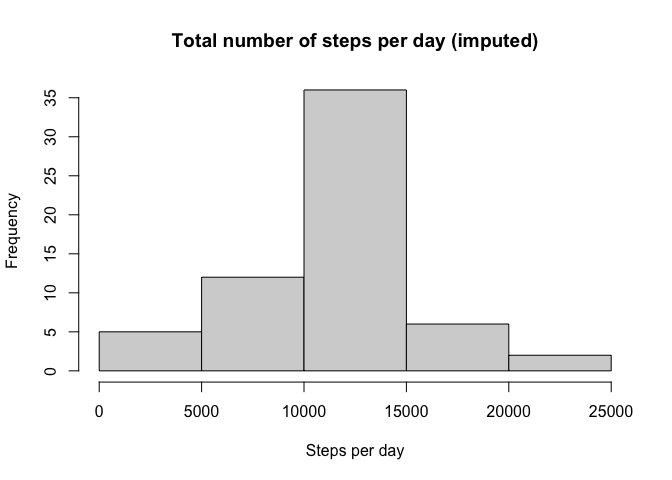
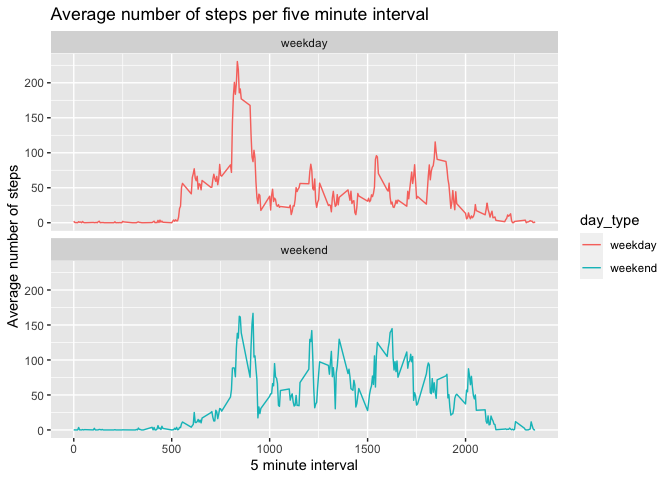

## Loading and preprocessing the data


```r
library("ggplot2")
#read file
activity_data <- read.csv("activity.csv", as.is = TRUE )
```

## What is mean total number of steps taken per day?

```r
#Calculate the total number of steps taken per day
tot_step_date <-aggregate(steps~date, activity_data, sum)

#histogram of the total number of steps taken each day
hist(tot_step_date$steps, main = "Total number of steps per day", xlab = "Steps per day")
```

<!-- -->

```r
#Calculate and report the mean and median of the total number of steps taken per day
summary(tot_step_date)
```

```
##      date               steps      
##  Length:53          Min.   :   41  
##  Class :character   1st Qu.: 8841  
##  Mode  :character   Median :10765  
##                     Mean   :10766  
##                     3rd Qu.:13294  
##                     Max.   :21194
```
The mean of the total number of steps taken per day is 10766
The median of the total number of steps taken per day is 10765

## What is the average daily activity pattern?

```r
#get the average number of steps taken per day 
ave_interval <- aggregate(steps~interval, activity_data, mean)

#plot the date for 5-minute interval (x-axis) and the average number of steps taken, averaged across all days (y-axis)
plot(ave_interval$interval, ave_interval$steps, type ="l",main="Average number of steps by Interval", xlab="Intervals", ylab="Average number of steps")
```

<!-- -->
 
 
 Which 5-minute interval, on average across all the days in the dataset, contains the maximum number of steps?


```r
#get the interval index for the highest average steps
maximum_steps <- which.max(ave_interval$steps)

# get specific interval and the average steps for that interval
ave_interval[maximum_steps, ]$interval
```

```
## [1] 835
```

```r
ave_interval[maximum_steps, ]$steps
```

```
## [1] 206.1698
```

The 5-minute interval with maximum steps is  835  and the number of steps for that interval is  206.2

## Imputing missing values

Calculate the total number of missing values in the dataset

```r
sum(is.na(activity_data$steps))
```

```
## [1] 2304
```

Replace missing NA values with the mean value of the interval 

```r
#I used strategy to fill all missing values with the mean values 
#create a new data set similar wot original to fill the missing values 
activity_new <-activity_data
for (i in 1:nrow(activity_new)) {
        if(is.na(activity_new$steps[i])) {
                dat <- ave_interval$steps[which(ave_interval$interval == activity_new$interval[i])]
                activity_new$steps[i] <- dat 
        }
}
```

Make a histogram of the total number of steps taken each day and Calculate the mean and median total number of steps taken per day. 

```r
#get the total number of steps taken for each day 
tot_step_date_new <- aggregate(steps ~ date, activity_new, sum)

#plot the histogram 
hist(tot_step_date_new$steps,main = "Total number of steps per day (imputed)", xlab = "Steps per day" )
```

<!-- -->

```r
#get mean and median of the imputed date set 
summary(tot_step_date_new)
```

```
##      date               steps      
##  Length:61          Min.   :   41  
##  Class :character   1st Qu.: 9819  
##  Mode  :character   Median :10766  
##                     Mean   :10766  
##                     3rd Qu.:12811  
##                     Max.   :21194
```
The mean (imputed) of the total number of steps taken per day is 10766
The median (imputed) of the total number of steps taken per day is 10766
I don’t see much difference in the mean and median compared to the date set with missing values. There is not much impact of imputing missing data on the estimates of the total daily number of steps.  

## Are there differences in activity patterns between weekdays and weekends?


```r
#Create a new factor variable in the dataset with two levels – “weekday” and “weekend” indicating whether a given date is a weekday or weekend day.
activity_new$date <- as.Date(activity_new$date)
activity_new$day <- weekdays(activity_new$date)

weekdays <- c('Monday', 'Tuesday', 'Wednesday', 'Thursday', 'Friday')

activity_new$day_type <- c('weekend', 'weekday')[(activity_new$day %in% weekdays)+1L]

#get the mean for each day 
activity_new_day_type <- aggregate(steps ~ interval + day_type, activity_new, mean)

#use ggplot to make a time series plot 
ggplot(activity_new_day_type, aes(x=interval, y=steps)) + geom_line(aes(colour = day_type))  +
        ggtitle("Average number of steps per five minute interval") + xlab("5 minute interval") + ylab("Average number of steps") +
        facet_wrap(~ day_type, ncol=1)
```

<!-- -->

There are small differences in activity patterns between weekdays and weekends.
